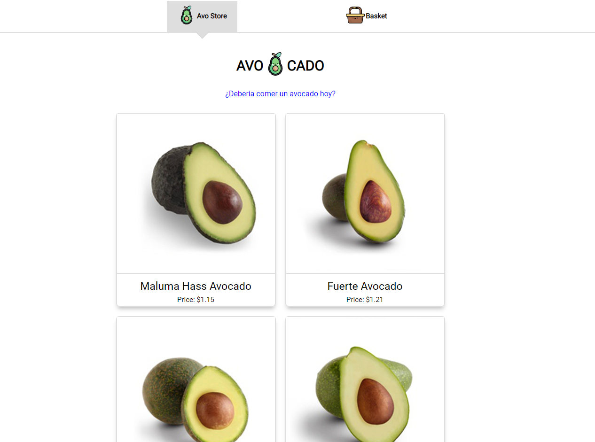
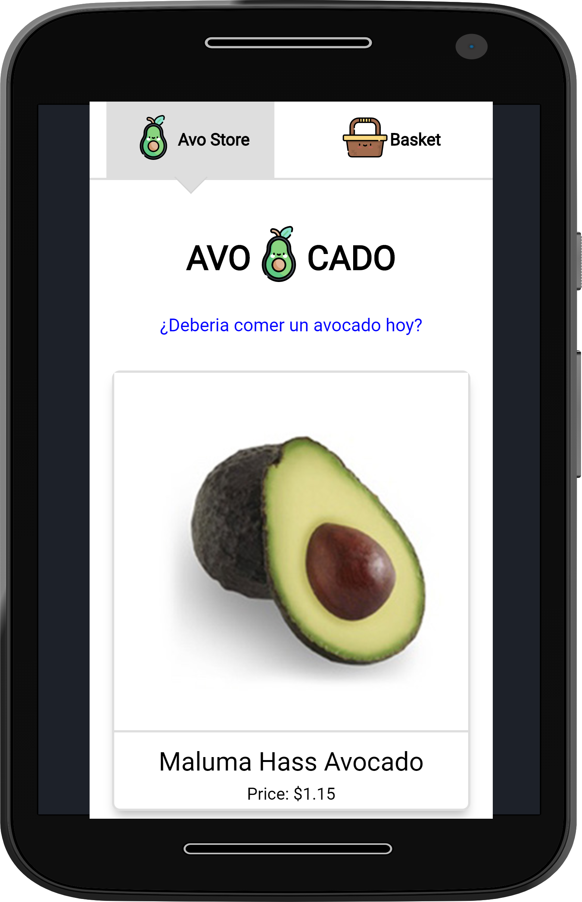

# Avocado_Store

App de venta de Avocados integrada una API de que esta puesta en Vercel.

## Desktop

## Mobile

## Como funciona?

Requiere Node.js 10 o mayor

- `npm install` para instalar las dependencias.
- `npm run dev` para el entorno de desarrollo.
- `npm run build && npm start` para el entorno de produccion.

## Demo

https://avocado-store.vzanthony.vercel.app/

## Licencia

MIT
